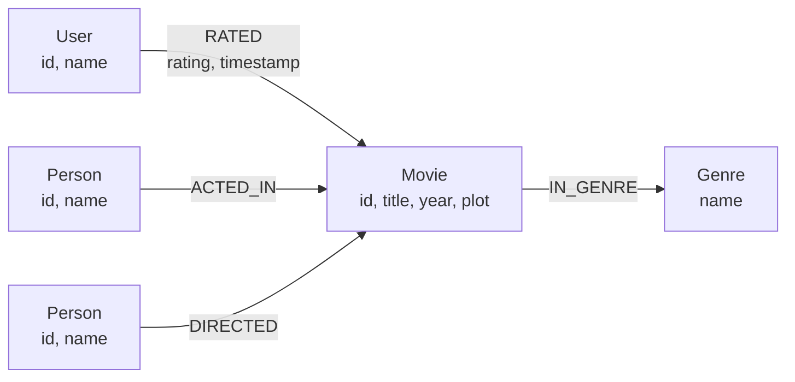
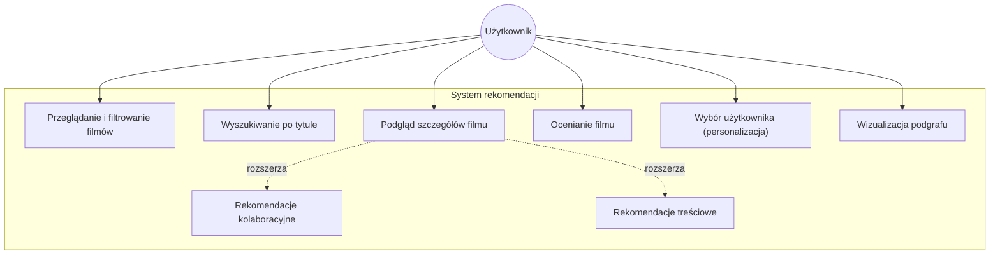
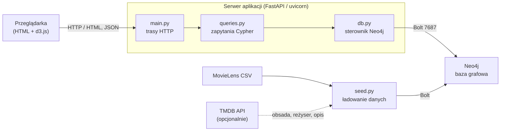
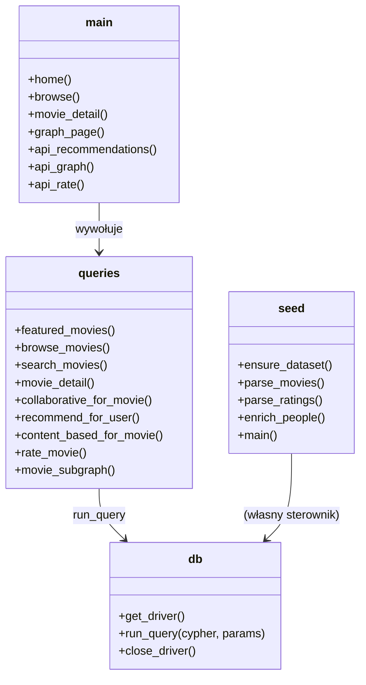
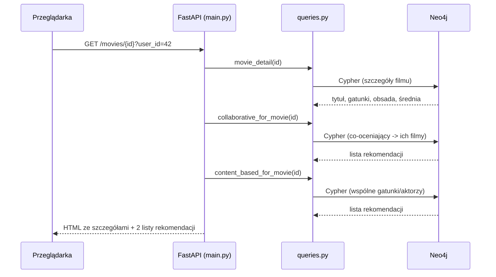

# Dokumentacja projektu — System rekomendacji filmów (Neo4j)

Projekt z grafowych baz danych. Aplikacja webowa rekomendująca filmy, oparta o
grafową bazę **Neo4j**, backend w **Pythonie (FastAPI)** i widoki **Jinja2 +
JavaScript** (aplikacja typu MPA, wzorzec zbliżony do MVC).

---

## 1. Cel i zakres

Pokazujemy, że problem rekomendacji filmów naturalnie układa się w graf:
użytkownicy, filmy, gatunki i osoby (aktorzy, reżyserzy) to węzły, a oceny i
powiązania to krawędzie. Rekomendacje liczymy bezpośrednio w języku Cypher —
przechodząc po grafie, a nie licząc w aplikacji.

Dwa rodzaje rekomendacji:

1. **Kolaboracyjna (collaborative filtering)** — „użytkownicy, którzy ocenili
   ten film podobnie, polubili też…”. Szukamy użytkowników o zbliżonym guście i
   polecamy filmy, które oni ocenili wysoko.
2. **Treściowa (content-based)** — podobne filmy po wspólnych gatunkach i
   aktorach.

---

## 2. Wybór technologii

| Warstwa | Technologia | Dlaczego |
| --- | --- | --- |
| Baza danych | Neo4j 5 | Natywna baza grafowa, język Cypher, wymagana w projekcie. |
| Backend | Python 3 + FastAPI | Szybkie REST/serwer WWW, czytelny kod. |
| Sterownik bazy | oficjalny `neo4j` (Python driver) | Połączenie Bolt, transakcje, pula połączeń. |
| Widoki | Jinja2 + vanilla JS | Serwer renderuje strony (MPA), bez frameworka SPA. |
| Wizualizacja grafu | d3.js | Rysuje podgraf w przeglądarce z danych JSON z backendu. |
| Dane | MovieLens „small” | ~9 700 filmów, ~100 000 ocen, ~600 użytkowników. |

---

## 3. Struktura grafu (model danych)

**Węzły:** `Movie`, `Person`, `Genre`, `User`.
**Krawędzie:** `RATED` (z oceną), `IN_GENRE`, `ACTED_IN`, `DIRECTED`.



**Ograniczenia (constraints)** — gwarantują unikalność kluczy i tworzą indeksy,
dzięki czemu `MERGE` przy ładowaniu danych działa szybko:

```cypher
CREATE CONSTRAINT movie_id   IF NOT EXISTS FOR (m:Movie)  REQUIRE m.id IS UNIQUE;
CREATE CONSTRAINT person_id  IF NOT EXISTS FOR (p:Person) REQUIRE p.id IS UNIQUE;
CREATE CONSTRAINT genre_name IF NOT EXISTS FOR (g:Genre)  REQUIRE g.name IS UNIQUE;
CREATE CONSTRAINT user_id    IF NOT EXISTS FOR (u:User)   REQUIRE u.id IS UNIQUE;
```

**Uwaga o danych.** MovieLens „small” zawiera tylko filmy, gatunki i oceny — nie
ma obsady, reżyserów ani opisów. Węzły `Person` oraz relacje `ACTED_IN` /
`DIRECTED` (i pole `Movie.plot`) dodaje opcjonalny krok wzbogacania danych z
API TMDB (po podaniu klucza `TMDB_API_KEY`). Bez klucza działa wszystko poza
częścią rekomendacji treściowej opartą o aktorów.

---

## 4. Diagramy UML

### 4.1. Diagram przypadków użycia

Co użytkownik może zrobić w aplikacji.



### 4.2. Diagram komponentów / wdrożenia

Jak elementy systemu są ze sobą połączone w czasie działania.



### 4.3. Diagram klas / modułów

Główne moduły backendu i ich odpowiedzialności.



### 4.4. Diagram sekwencji — rekomendacja kolaboracyjna

Przepływ przy wejściu na stronę szczegółów filmu (lub `/api/recommendations`).



---

## 5. Realizacja założeń funkcjonalnych (polecenia Cypher)

Wszystkie zapytania są w `app/queries.py` z komentarzami. Poniżej kluczowe.

### 5.1. Przeglądanie z filtrem gatunku i roku

```cypher
MATCH (m:Movie)
WHERE ($genre IS NULL OR EXISTS { (m)-[:IN_GENRE]->(:Genre {name: $genre}) })
  AND ($year  IS NULL OR m.year = $year)
OPTIONAL MATCH (m)<-[r:RATED]-(:User)
WITH m, avg(r.rating) AS avgRating, count(r) AS numRatings
RETURN m.id, m.title, m.year, avgRating, numRatings
ORDER BY numRatings DESC, m.title
SKIP $skip LIMIT $limit
```

### 5.2. Szczegóły filmu (obsada, reżyser, gatunki, średnia ocena)

Użycie *pattern comprehensions* zamiast wielu `OPTIONAL MATCH` zapobiega
mnożeniu wierszy i utrzymuje jedno szybkie zapytanie.

```cypher
MATCH (m:Movie {id: $id})
OPTIONAL MATCH (m)<-[r:RATED]-(:User)
WITH m, avg(r.rating) AS avgRating, count(r) AS numRatings
RETURN m.id, m.title, m.year, m.plot,
       [(m)-[:IN_GENRE]->(g) | g.name]  AS genres,
       [(p)-[:ACTED_IN]->(m) | p.name]  AS actors,
       [(p)-[:DIRECTED]->(m) | p.name]  AS directors,
       avgRating, numRatings
```

### 5.3. Rekomendacja kolaboracyjna — „polubili też…”

Wzorzec z założeń: `(u)-[RATED]->(m)<-[RATED]-(other)-[RATED]->(rec)`.

```cypher
MATCH (u:User {id: $userId})-[r1:RATED]->(m:Movie)<-[r2:RATED]-(other:User)
WHERE u <> other AND abs(r1.rating - r2.rating) <= 1.0
WITH u, other, count(*) AS overlap
ORDER BY overlap DESC LIMIT $neighbours
MATCH (other)-[r3:RATED]->(rec:Movie)
WHERE r3.rating >= 4 AND NOT EXISTS { (u)-[:RATED]->(rec) }
RETURN rec.id, rec.title, sum(overlap * r3.rating) AS score,
       avg(r3.rating) AS avgRating, count(*) AS votes
ORDER BY score DESC LIMIT $limit
```

Wersja „dla jednego filmu” (na stronie szczegółów) — krótsza, bez wybranego
użytkownika:

```cypher
MATCH (m:Movie {id: $id})<-[r1:RATED]-(other:User)-[r2:RATED]->(rec:Movie)
WHERE r1.rating >= 4 AND r2.rating >= 4 AND rec <> m
RETURN rec.id, rec.title, count(*) AS coRaters, avg(r2.rating) AS avgRating
ORDER BY coRaters DESC LIMIT $limit
```

### 5.4. Rekomendacja treściowa (gatunki + aktorzy)

Każdy wspólny aktor liczy się 3× mocniej niż wspólny gatunek.

```cypher
MATCH (m:Movie {id: $id})
CALL {
    WITH m
    MATCH (m)-[:IN_GENRE]->(:Genre)<-[:IN_GENRE]-(rec:Movie) WHERE rec <> m RETURN rec
  UNION
    WITH m
    MATCH (m)<-[:ACTED_IN]-(:Person)-[:ACTED_IN]->(rec:Movie) WHERE rec <> m RETURN rec
}
WITH m, rec,
     size([(m)-[:IN_GENRE]->(g)<-[:IN_GENRE]-(rec) | g]) AS genreOverlap,
     size([(m)<-[:ACTED_IN]-(p)-[:ACTED_IN]->(rec) | p]) AS actorOverlap
WITH rec, genreOverlap + 3 * actorOverlap AS score, genreOverlap, actorOverlap
WHERE score > 0
RETURN rec.id, rec.title, score, genreOverlap, actorOverlap
ORDER BY score DESC LIMIT $limit
```

### 5.5. Wyszukiwanie po tytule

```cypher
MATCH (m:Movie)
WHERE toLower(m.title) CONTAINS toLower($q)
RETURN m.id, m.title, m.year LIMIT $limit
```

### 5.6. Ocenianie filmu (upsert oceny)

```cypher
MATCH (u:User {id: $userId})
MATCH (m:Movie {id: $movieId})
MERGE (u)-[r:RATED]->(m)
SET r.rating = $rating, r.timestamp = timestamp()
RETURN r.rating AS rating
```

---

## 6. Opis wdrożenia

Trzy kroki: baza → załadowanie danych → uruchomienie serwera.

1. **Baza Neo4j.** Najprościej przez Docker:
   ```bash
   docker compose up -d        # Bolt 7687, panel http://localhost:7474
   ```
   Alternatywnie chmurowa AuraDB lub lokalna instalacja Neo4j Desktop.

2. **Konfiguracja.** Kopiujemy `.env.example` do `.env` i wpisujemy dane
   dostępowe (`NEO4J_URI`, `NEO4J_USER`, `NEO4J_PASSWORD`). Opcjonalnie
   `TMDB_API_KEY` włącza wzbogacanie o obsadę/reżysera/opis.

3. **Zależności i dane.**
   ```bash
   python3 -m venv venv && source venv/bin/activate
   pip install -r requirements.txt
   python -m seed.seed --reset     # pobiera MovieLens i ładuje do Neo4j
   ```

4. **Serwer.**
   ```bash
   uvicorn app.main:app --reload   # http://127.0.0.1:8000
   ```

### Architektura wdrożenia

- Backend FastAPI łączy się z Neo4j po protokole **Bolt** (port 7687), używając
  jednej puli połączeń (`db.py`).
- Przeglądarka komunikuje się tylko z backendem (HTTP). Wizualizacja grafu
  pobiera dane przez `GET /api/graph/{id}` — dane logowania do bazy **nigdy** nie
  trafiają do przeglądarki.
- Skrypt `seed.py` jest niezależny od serwera WWW; ładuje dane jednorazowo.

### Skalowanie i wydajność

- Unikalne ograniczenia tworzą indeksy na kluczach — `MERGE` po `id` jest
  szybki, a ładowanie ocen odbywa się partiami (`UNWIND` po ~2000 wierszy).
- Zapytania rekomendacyjne ograniczają liczbę kandydatów (np. najpierw szukamy
  „sąsiadów” użytkownika, dopiero potem ich filmów), co utrzymuje rozsądny czas
  odpowiedzi na zbiorze „small”.
